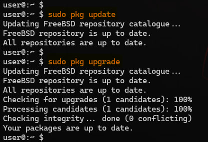
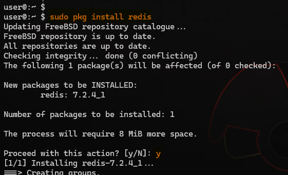
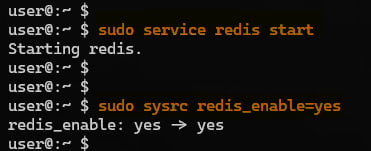

# Как установить Redis® на FreeBSD 14.0

## Введение

В этом руководстве описан процесс установки Redis® на FreeBSD 14.0. Redis® — это популярная система управления базами данных с открытым исходным кодом, работающая в памяти и используемая в качестве кэша и брокера сообщений. Эта инструкция поможет установить и настроить Redis® для оптимальной работы на вашем сервере.

## Предварительные условия

Перед началом установки убедитесь, что:

- У вас есть доступ к серверу с установленной FreeBSD 14.0.
- У вас есть права суперпользователя или возможность использовать команду `sudo`.

## Основное содержание

### Шаг 1: Обновление системы

Прежде чем устанавливать Redis®, обновите пакеты системы. Выполните следующие команды:
    $ sudo pkg update
    $ sudo pkg upgrade
```

Эти команды обновят список пакетов и установят последние версии всех пакетов.

### Шаг 2: Установка Redis®

Для установки Redis® используйте команду:

```sh
$ sudo pkg install redis
```

Подтвердите установку, введя `y` при появлении запроса и нажмите клавишу :key_enter:.



### Шаг 3: Настройка Redis®

После установки Redis® необходимо настроить его для автоматического запуска и задать основные параметры конфигурации.

1. Откройте файл конфигурации Redis®:

    ```sh
    $ sudo vi /usr/local/etc/redis.conf
    ```

2. Найдите и измените следующие параметры по мере необходимости:

    - `bind`: Укажите IP-адрес, на котором Redis® будет прослушивать подключения. По умолчанию это `127.0.0.1` (локальные подключения).
    - `protected-mode`: Установите `yes`, чтобы включить защищённый режим.
    - `port`: Укажите порт для подключения. По умолчанию это `6379`.
    - `daemonize`: Установите `yes`, чтобы запустить Redis® как демон.

### Шаг 4: Запуск и автозагрузка Redis®

Для запуска Redis® используйте команду:

```sh
$ sudo service redis start
```

Чтобы настроить Redis® на автоматический запуск при загрузке системы, выполните:

```sh
$ sudo sysrc redis_enable=yes
```


### Шаг 5: Проверка работы Redis®

После запуска Redis® проверьте его состояние с помощью команды:

```sh
$ sudo service redis status
```

Вы должны увидеть сообщение, указывающее, что Redis® работает.


## Следующие шаги и ссылки

Теперь Redis® установлен и настроен на вашем сервере FreeBSD 14.0. Вы можете продолжить с дальнейшей настройкой и оптимизацией Redis®, основываясь на ваших конкретных требованиях. Для получения дополнительной информации и рекомендаций по настройке посетите официальную [документацию Redis®](https://redis.io/documentation).

Если вы хотите настроить клиент для подключения к вашему серверу Redis®, ознакомьтесь с [инструкциями по установке клиента Redis®](https://redis.io/topics/clients).
